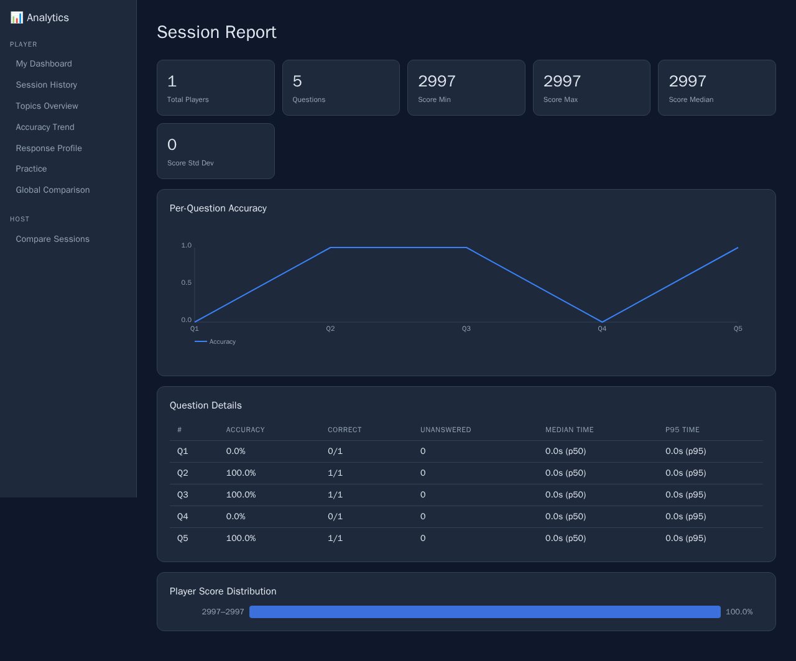
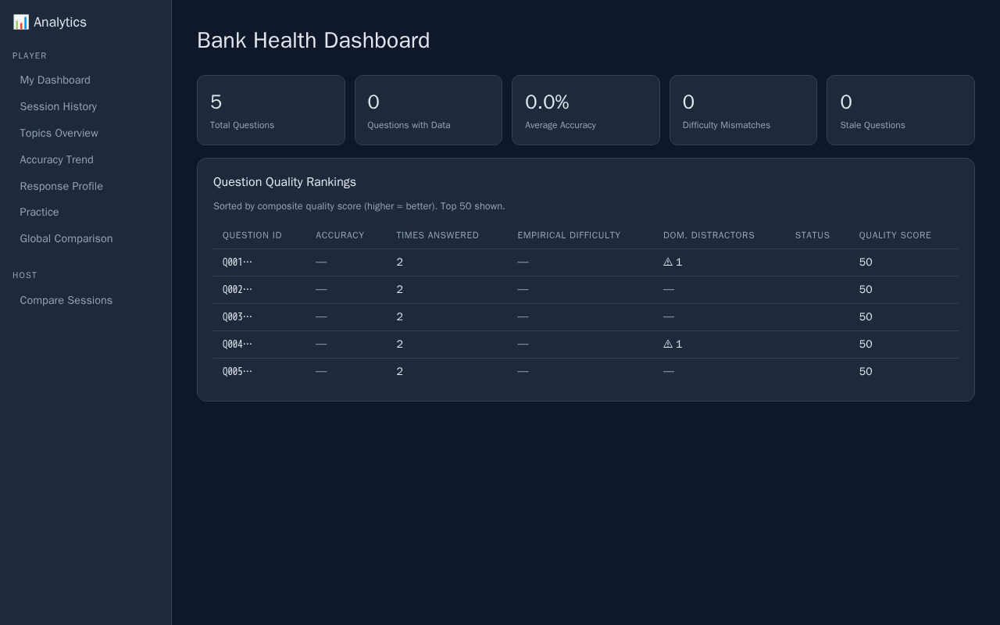
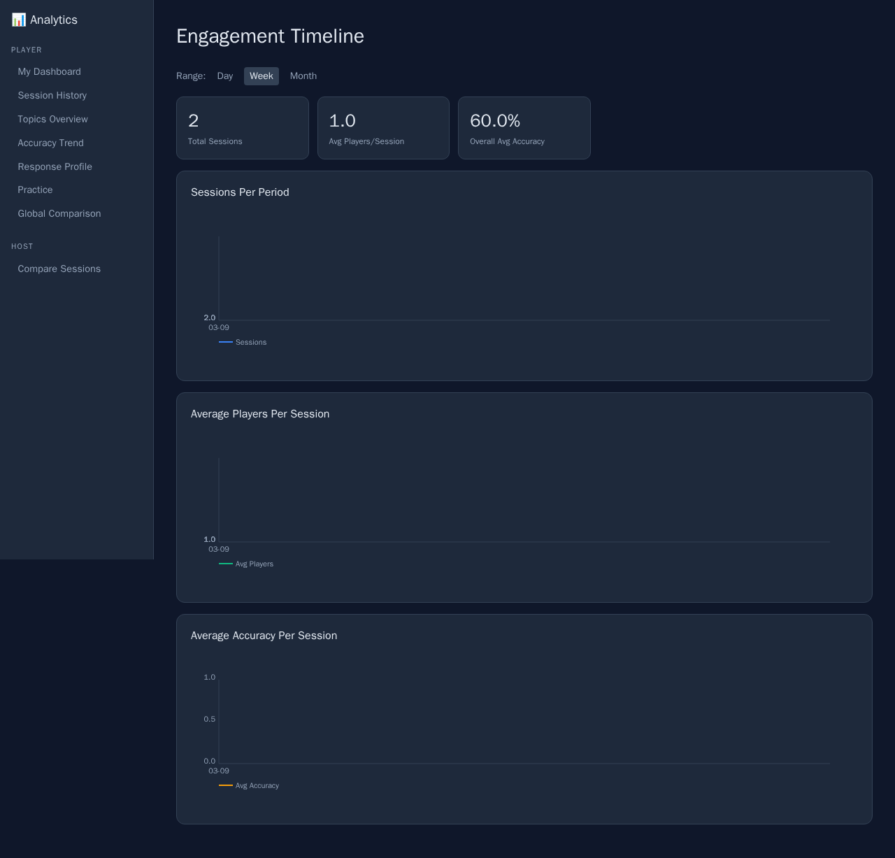
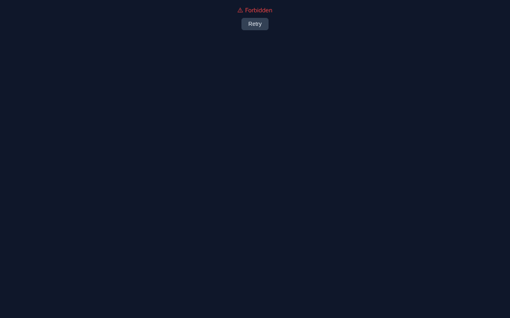

# Host Analytics Guide

This guide covers every page available in the **Host** section of the analytics dashboard. All data shown is scoped to sessions and question banks *you* have hosted.

---

## Accessing Host Views

Host analytics views are not directly listed in the sidebar — they are accessed by URL. The typical workflow is:

1. Run a quiz session in the host app
2. After the session finishes, follow the **"View Analytics"** links — or navigate directly to the URLs described below
3. Use **Compare Sessions** (the only sidebar link under Host) to start a comparison

---

## Session Report

**URL:** `#/host/sessions/:sessionId`



A full breakdown of a single quiz session from the host's perspective.

### Summary Cards

| Card | Description |
|------|-------------|
| **Total Players** | Number of players who joined and completed the session |
| **Questions** | Total questions in the session |
| **Score Min / Max** | Lowest and highest score among all players |
| **Score Median** | Middle score — a good indicator of the typical player's result |
| **Score Std Dev** | Standard deviation — a high value means players had very different results |

### Per-Question Accuracy Chart

A line chart showing accuracy for each question (Q1, Q2, …) across all players. Sharp dips reveal the questions that tripped players up.

### Question Details Table

Each question in the session, with aggregated stats:

| Column | Description |
|--------|-------------|
| **#** | Question number (Q1–QN) |
| **Accuracy** | Percentage of players who answered correctly |
| **Correct** | `correct / answered` count |
| **Unanswered** | Number of players who did not submit an answer in time |
| **Median Time** | Median response time (p50) across all players |
| **p95 Time** | The 95th-percentile response time — how long the slowest players took |

> **Tip:** A question with 0% accuracy is either very hard, poorly worded, or has an incorrect answer key. Consider revising it in your question bank.

### Player Score Distribution

A histogram of final player scores — a wide spread suggests mixed skill levels in your audience.

---

## Bank Health

**URL:** `#/host/banks/:bankId/health`



An audit of a question bank's overall quality, based on aggregated data from all sessions that used it.

### Summary Cards

| Card | Description |
|------|-------------|
| **Total Questions** | Total questions in the bank |
| **Questions with Data** | How many questions have been answered at least once |
| **Average Accuracy** | Across all sessions and players |
| **Difficulty Mismatches** | Questions whose real-world difficulty (from player answers) differs significantly from the stated difficulty tag |
| **Stale Questions** | Questions that have not been answered in a long time |

### Question Quality Rankings Table

Each question ranked by **quality score** (0–100). A high quality score means the question has a good difficulty balance — not too easy, not too hard, with clear distractors.

| Column | Description |
|--------|-------------|
| **Question ID** | Truncated question identifier |
| **Accuracy** | Actual accuracy across all answers (`—` if never answered) |
| **Times Answered** | Total answer submissions |
| **Empirical Difficulty** | Derived from player accuracy (e.g. `hard` if < 40% get it right) |
| **Dom. Distractors** | ⚠ indicates an incorrect answer option that is being selected most often — may indicate a misleading distractor |
| **Status** | Flags like `too-easy`, `too-hard`, `stale` |
| **Quality Score** | Composite score: higher = better question |

> **Tip:** Sort your bank revision list by questions with low quality scores or `too-easy`/`too-hard` flags. These are candidates for rewriting.

---

## Engagement

**URL:** `#/host/banks/:bankId/engagement?range=week`



Shows how frequently a question bank is being used and how player accuracy evolves over time.

### Controls

Use the **range** query parameter to select `day`, `week` (default), or `month` to control the time window.

### What's Shown

- **Session frequency** — a bar chart of how many sessions were run per time bucket
- **Average accuracy trend** — how player accuracy on this bank has changed over sessions
- **Participation** — total number of players over the selected period

> **Tip:** A declining accuracy trend combined with rising session frequency usually means you are attracting new, less experienced players. An accuracy plateau suggests the current question set is well-calibrated.

---

## Compare Sessions

**URL:** `#/host/sessions/compare`  
**With data:** `#/host/sessions/compare?sessionA=:id1&sessionB=:id2`



Side-by-side comparison of **two sessions** you hosted — useful when you want to know if a question bank played differently with different audiences, or if you adjusted question order/timing.

### Using the Comparison Form

Open the empty compare page and enter two session IDs:

```
http://localhost:3003/analytics/#/host/sessions/compare
```

You must own **both** sessions. If you enter a session ID that belongs to another host, you will see a `Forbidden` error.

Both sessions must use the **same question bank** to produce a meaningful comparison.

### What's Compared

| Section | Description |
|---------|-------------|
| **Player counts** | How many players were in each session |
| **Score distributions** | Min, max, median, std dev side by side |
| **Per-question accuracy** | Accuracy for each question in both sessions, visualised on the same chart — lets you spot which questions performed differently between the two runs |
| **Accuracy delta** | The difference in accuracy per question between session A and B, highlighting where performance changed most |

### How to Get Session IDs

The session ID appears in the URL when you view a session report:  
`#/host/sessions/**65a2cc27-1b3d-4cea-bec1-1ae1b86ba03b**`

You can also copy it from the host app immediately after a quiz ends.

---

## Quick Reference: URL Patterns

| View | URL pattern |
|------|-------------|
| Session Report | `#/host/sessions/{sessionId}` |
| Bank Health | `#/host/banks/{bankId}/health` |
| Engagement (week) | `#/host/banks/{bankId}/engagement` |
| Engagement (custom range) | `#/host/banks/{bankId}/engagement?range=day\|week\|month` |
| Compare Sessions | `#/host/sessions/compare?sessionA={id1}&sessionB={id2}` |

> Bank IDs use URL encoding for slashes: `pop-culture/music` becomes `pop-culture%2Fmusic`.

---

← [Back to Analytics Overview](README.md)
