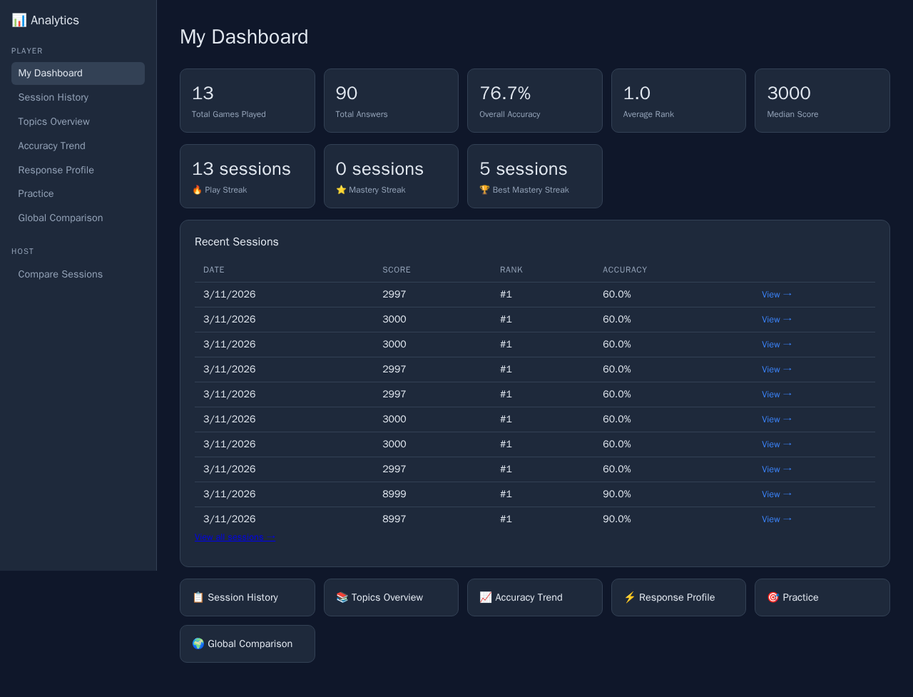
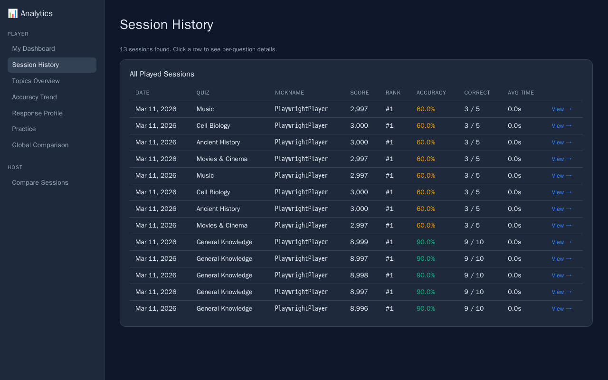
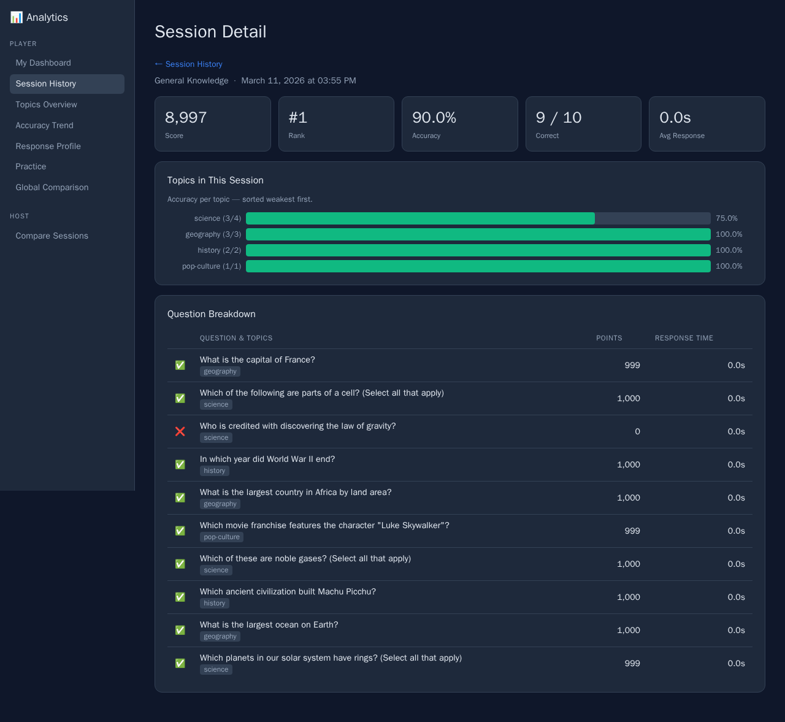
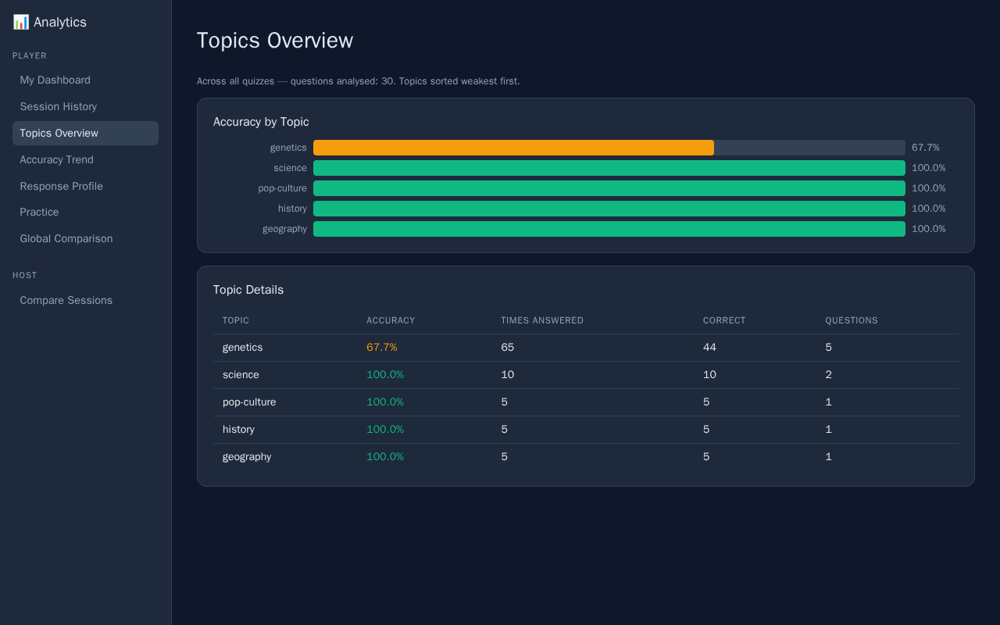
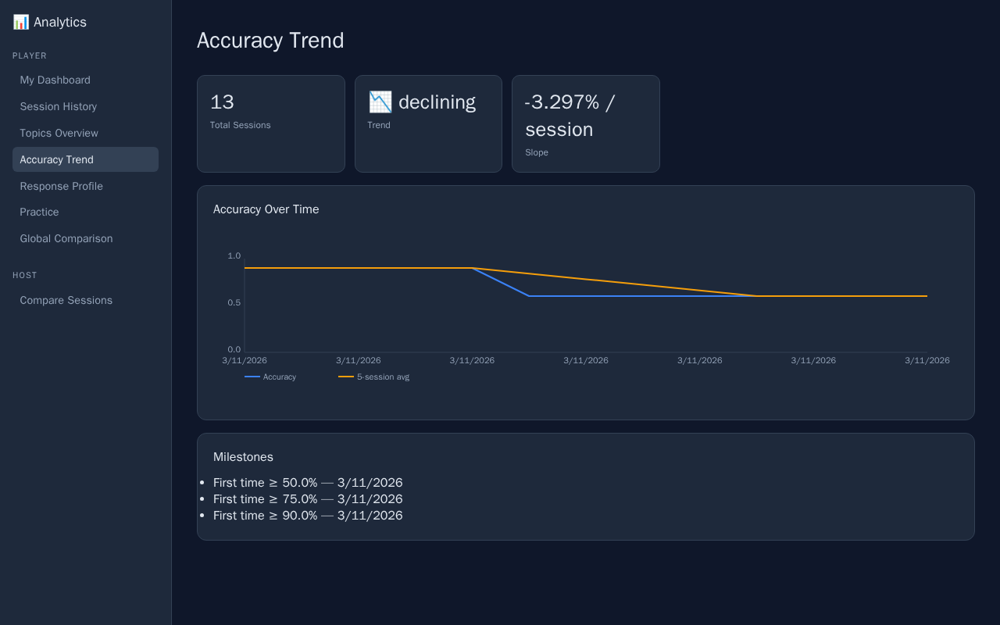
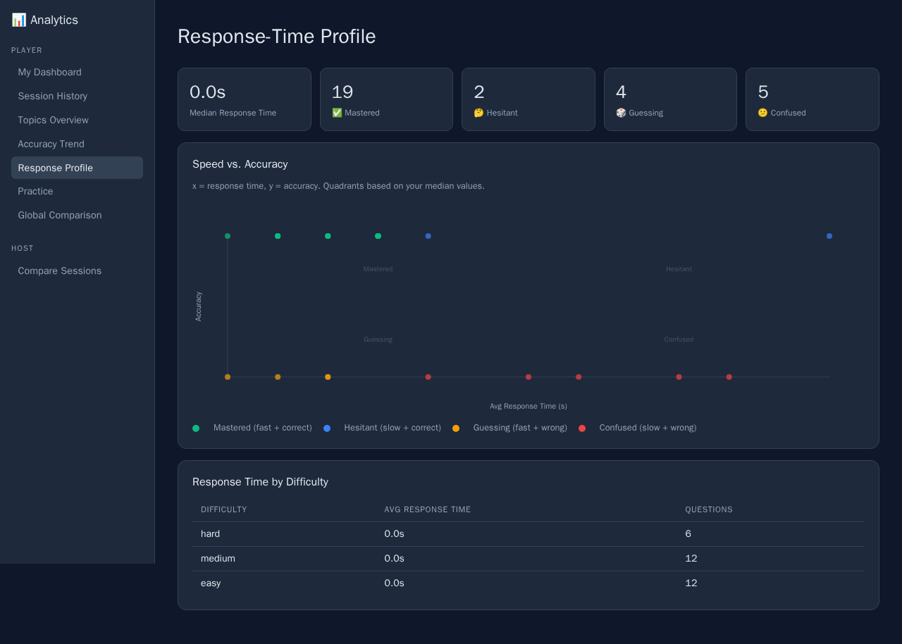
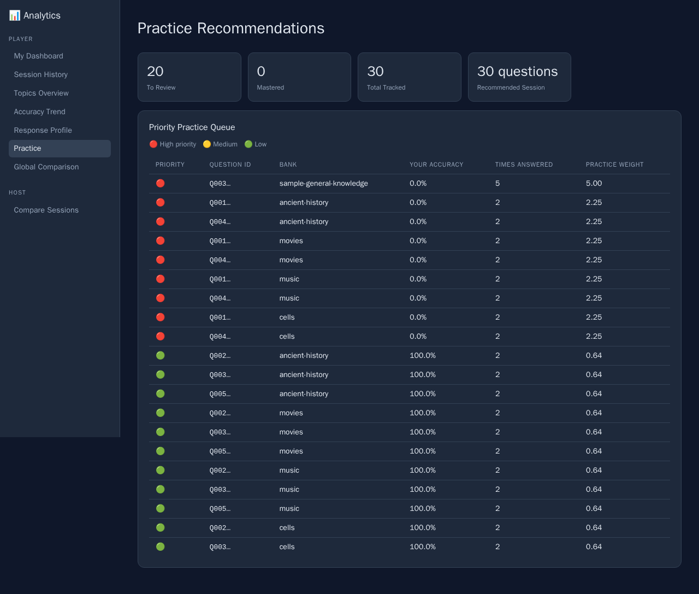
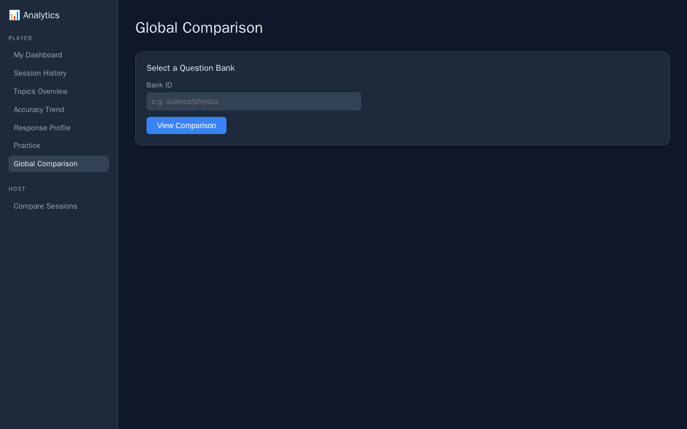

# Player Analytics Guide

This guide covers every page available in the **Player** section of the analytics dashboard. All data shown is personal — only you can see your own stats.

---

## My Dashboard

**URL:** `#/player/dashboard`



Your personal summary at a glance.

### Stat Cards (top row)

| Card | What it means |
|------|--------------|
| **Total Games Played** | Number of quiz sessions you have completed |
| **Total Answers** | Total questions you have answered across all sessions |
| **Overall Accuracy** | Percentage of questions you answered correctly, across all time |
| **Average Rank** | Your average finishing position (1.0 = always first) |
| **Median Score** | The middle score of all your sessions — a good indicator of typical performance |

### Streak Cards (second row)

| Card | What it means |
|------|--------------|
| 🔥 **Play Streak** | How many sessions you have played in a row (any result) |
| ⭐ **Mastery Streak** | How many consecutive sessions with ≥ 80% accuracy |
| 🏆 **Best Mastery Streak** | Your longest mastery streak ever |

### Recent Sessions Table

Shows your 10 most recent sessions. Click any row — or the **View →** link — to open the [Session Detail](#session-detail) for that quiz.

The **View all sessions →** link at the bottom takes you to the full [Session History](#session-history).

### Quick-Links Panel

Tiles at the bottom of the dashboard link directly to all other player views.

---

## Session History

**URL:** `#/player/sessions`



A complete list of every quiz you have participated in, sorted newest first.

### Columns

| Column | Description |
|--------|-------------|
| **Date** | When the session was completed |
| **Quiz** | Name of the question bank used |
| **Nickname** | The name you played under in that session |
| **Score** | Your final score |
| **Rank** | Your finishing position among all players in that session |
| **Accuracy** | Percentage of questions answered correctly — colour coded: 🟢 ≥ 80%, 🟡 50–79%, 🔴 < 50% |
| **Correct** | Exact correct/total count (e.g. `9 / 10`) |
| **Avg Time** | Your average response time per question |

**Click any row** to jump to the [Session Detail](#session-detail) for that quiz.

---

## Session Detail

**URL:** `#/player/sessions/:id`



A deep dive into a single quiz session.

### Stat Cards

Summarises your performance for just that session: score, final rank, accuracy, correct/total, and average response time.

### Topics in This Session

A horizontal bar chart showing your accuracy per topic, sorted weakest-first. Colours follow the same traffic-light scheme: 🟢 ≥ 80%, 🟡 50–79%, 🔴 < 50%.

This helps you immediately see *which topic let you down* in a specific quiz.

### Question Breakdown Table

Every question from the session, in order:

| Column | Description |
|--------|-------------|
| **✅ / ❌** | Whether you answered correctly |
| **Question & Topics** | Full question text with topic tag(s) |
| **Points** | Points you earned for this question (0 if wrong) |
| **Response Time** | How long you took to answer |

Use the **← Session History** breadcrumb at the top to return to the full list.

---

## Topics Overview

**URL:** `#/player/topics`



Your accuracy broken down by **topic**, aggregated across *all* quizzes you have played.

### Accuracy by Topic Chart

A horizontal bar chart where each bar represents one topic. Bars are sorted weakest-first so the topics you struggle with most are immediately visible at the top. Colours: 🟢 ≥ 80%, 🟡 50–79%, 🔴 < 50%.

### Topic Details Table

The same data in table form with extra context:

| Column | Description |
|--------|-------------|
| **Topic** | Topic name |
| **Accuracy** | Your overall accuracy for questions tagged with this topic |
| **Times Answered** | Total number of times you have answered a question with this topic |
| **Correct** | How many answers were correct |
| **Questions** | How many distinct questions carry this topic tag |

> **Tip:** A topic with low accuracy *and* many times answered is a real weak spot — consider focusing your practice there.

---

## Accuracy Trend

**URL:** `#/player/trend`



A line chart showing how your accuracy has changed session by session over time.

### Summary Cards

| Card | Description |
|------|-------------|
| **Total Sessions** | Number of sessions plotted |
| **Trend** | Direction: rising 📈, declining 📉, or steady ➡️ |
| **Slope** | Average change in accuracy per session (e.g. "+1.5% / session") |

### Accuracy Over Time Chart

Two lines are plotted:
- **Accuracy** — your raw accuracy for each individual session
- **5-session avg** — a rolling average to smooth out one-off results

The chart lets you spot if you are genuinely improving or if one great session was just luck.

### Milestones

A list of dates when you first crossed accuracy thresholds (50%, 75%, 90%). These are personal achievements — each appears only once when you first earned it.

---

## Response Profile

**URL:** `#/player/speed`



Analyses not just *whether* you answered correctly, but *how quickly*.

### Summary Cards

| Card | Description |
|------|-------------|
| **Median Response Time** | Your typical answer speed |
| **Mastered** | Questions you answered fast AND correctly |
| **Hesitant** | Questions you got right but took a long time — you know it, but not confidently |
| **Guessing** | Questions you answered quickly but got wrong — fast but unlucky (or guessing) |
| **Confused** | Questions you answered slowly AND got wrong — these need the most work |

### Speed vs. Accuracy Scatter Plot

Each dot represents one question. The chart is divided into four quadrants based on your *personal* median response time:

```
                 SLOW
          ┌───────────────┐
     C    │   Hesitant    │   Mastered    │
     O    │  (slow+right) │  (fast+right) │
     R ───┤───────────────┤───────────────┤ ACCURACY
     R    │   Confused    │   Guessing    │
     E    │  (slow+wrong) │  (fast+wrong) │
     C    └───────────────┘
                 FAST
```

Hover over any dot to see the question ID and its exact accuracy / response time.

### Response Time by Difficulty

A table showing how your response time varies across difficulty levels (easy, medium, hard). If you spend more time on easy questions than hard ones, that is worth investigating.

---

## Practice

**URL:** `#/player/practice`



An automatically generated revision queue, prioritising the questions most worth revisiting.

### Summary Cards

| Card | Description |
|------|-------------|
| **To Review** | Questions flagged as needing more practice |
| **Mastered** | Questions you have answered correctly enough times to be considered mastered |
| **Total Tracked** | Total distinct questions in your history |
| **Recommended Session** | Suggested number of questions for your next practice session |

### Priority Practice Queue

The table lists questions sorted by **practice weight** — a score that combines your accuracy and how many times you have seen the question. Higher weight = needs more work.

| Priority | Meaning |
|----------|---------|
| 🔴 High | Wrong multiple times or never got right — start here |
| 🟡 Medium | Got it right sometimes but not consistently |
| 🟢 Low | Mostly correct — review to maintain mastery |

> **How to use this:** Before your next quiz session, scan the 🔴 High priority questions. If a bank name appears repeatedly, consider hosting or joining a session with that specific bank to drill those questions.

---

## Global Comparison

**URL:** `#/player/compare`



Compares your performance against all other players on the same question banks.

Shows per-bank stats where your accuracy is compared to the global average for that bank. This lets you know whether a low accuracy score reflects a *hard bank* — or just areas where you need more practice.

---

## Navigation

Use the **sidebar** on the left to move between views at any time. The sidebar is always visible, so you can quickly jump from one analysis to another without losing your place.

← [Back to Analytics Overview](README.md)
